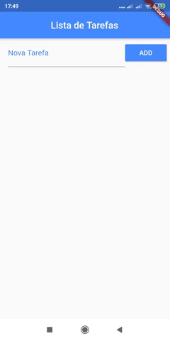
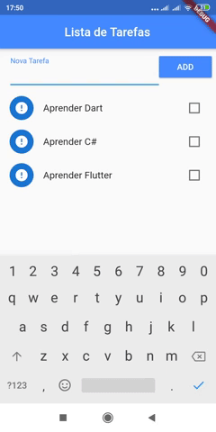

 # Lista de Tarefas

Aplicativo para salvar e controlar tarefas utilizando JSON e ToDo List. Permite adicionar tarefa, marcar como concluída e atualizar para organizar as que foram realizadas separando das que estão pendentes, e por fim, remover as tarefas.

## Clonar repositório

`` git clone https://github.com/thiagosr135/lista_tarefas.git ``

## Autor
* **Thiago de Souza Ribeiro** - [thiagosr135](https://github.com/thiagosr135)
